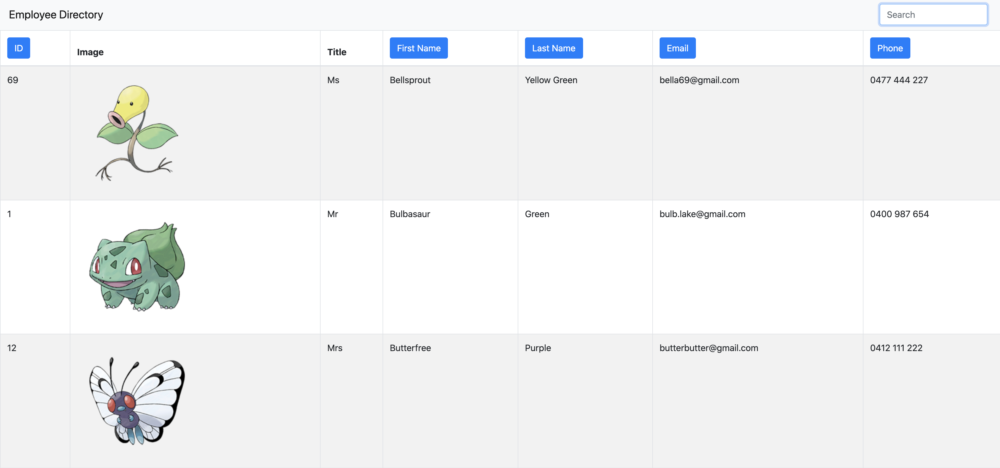

# Employee Directory
  

  ## Preview
  

  ## Description
  * Employee Directory assists employers to view their entire employee directory at once and provides quick access to employee information.

  * Technologies used: HTML, CSS, Javascript, Node.js, Express, MongoDB, Mongoose, React, Heroku, Bootstrap, gh-pages

  * Deployed application on Github: https://roukell.github.io/employee_directory/

  ## User Story

  * As a user, I want to be able to view my entire employee directory at once so that I have quick access to their information.

  ## Business Context

  * An employee or manager would benefit greatly from being able to view non-sensitive data about other employees. It would be particularly helpful to be able to filter employees by name.

  ## Table of Contents
  * [Installation](#installation)
  * [Usage](#Usage)
  * [License](#License)
  * [Contributing](#Contributing)
  * [Questions](#Questions)

  ## Installation
  To install necessary dependencies, run the following command:

      npm i

  ## Usage
  1. Fork the repository
  2. Edit employee details in `./utils/Employees.js`
  3. Use the website locally or deploy it online.

  ☝ To use this app directly, click on the GitHub link under [Description](#Description). 
  1. Search your employee. You can search by id, first name, last name, email, and phone number.
  2. To sort the employee, click on a property that you want to sort in the table. For example, click 'Last Name' if you want to sort by last name in ascending or descending order.
  3. Enjoy the website! 🌸

  ## License
  * MIT

  ## Contributing
  The app is contributed by Melody Lo.
    
  🌟 Many thanks to The Official Pokémon Website | Pokemon.com for providing Pokémon data. 🌟

  ## Questions
  * If you have any questions, feel free to contact me via email: yiling.melody.lo@gmail.com
  * My GitHub profile: https://github.com/roukell
  * My portfolio: https://melodylo.com

  